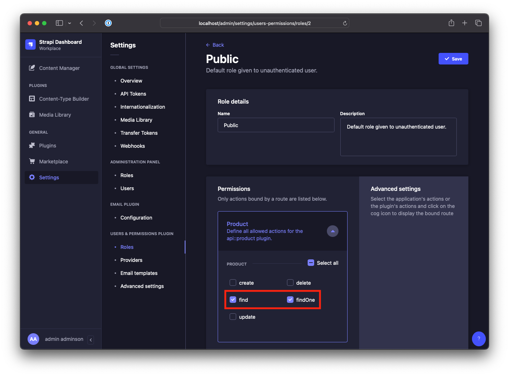

# Nuxt 3 & Strapi 4 in Docker 

This is a Boilerplate made with [Nuxt.js 3](https://nuxt.com/) and [Strapi 4](https://docs.strapi.io/dev-docs/quick-start#_1-install-strapi-and-create-a-new-project) wrapped in a Docker Container. 

## Installation 

```bash
git clone git@github.com:tarikkavaz/N3S4D.git
cd NuxtStrapiDocker #Run all commands from here 
cp backend/.env.example backend/.env
cp frontend/utils/api.js.example frontend/utils/api.js
yarn install
yarn setup

```

## Run Development Server
```bash
yarn dev #open http://localhost:3000/ and http://localhost:1337/
```
## Run Docker
```bash
docker-compose up #open http://localhost/ and http://localhost/admin/
```
## Setup Admin
1. Open Strapi Admin and create an account
2. Under **Users & Permissions** open the **Roles Page**
3. Select **Public** and give your Collection Type `find` and `findOne` permitions.

4. Add some content in Content Manager. Don't forget to **Publish!**
5. Repeat step 4 with **About** and **Homepage**

## Build 
Enter your Domain in `frontend/utils/api.js` at line 5
```javascript
import axios from 'axios';

export const baseUrl = process.env.NODE_ENV === 'development'
  ? 'http://localhost:1337/api'
  : 'http://xx.xxx.xx.x';
```

Run 
```bash
yarn build
docker-compose up --build

```
